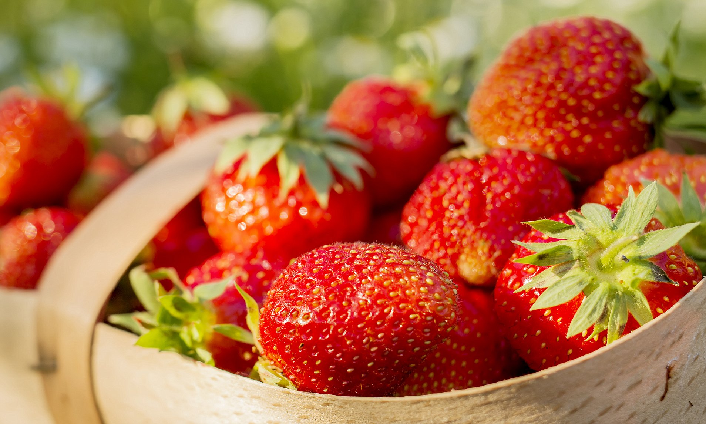

*from assignment: * Using R, produce a pdf document presenting your results. The
document should be structured with appropriate headings, tables, plots, images, 
and maps. Make sure to include citations. 

```{r setup, include=FALSE, echo=FALSE}
knitr::opts_chunk$set(echo = TRUE)
pacman::p_load("tidyverse","knitr","kableExtra","ggplot2", "ggbiplot")
# options(warn = -1)
```

```{r, include=FALSE}
source("wrangling.R", echo=TRUE)
source("figure_functions.R", echo = TRUE)
```



\newpage

# 1. Introduction

In this project, we use the data sets strawberries, insecticides, and herbicides-fungicides-other from USDA. We first wrangled these files, finished data cleaning and organizing the final data set; then we start to visualize and explore the data. This report focus on 2 main parts: Data cleaning and EDA.

- Data cleaning: We wrangle the data sets strawberries, insecticides, and herbicides-fungicides-other. Separate some columns and eliminate the redundancy.
- EDA: We plot a pie chart with a proportion of dataset by states, maps of comparison of strawberry yields and pesticide application between states and years, and a dot plot of the relationship between the level of Bee Toxicity and Carcinogen level.

Besides, we deploy a shiny app [Shiny_strawberries](https://rongli.shinyapps.io/shiny/) for data display and exploration.

# 2. Research Questions

* Comparison of strawberry yields between states.  

* How does the pesticide application vary between states and years?  

* Is there any relationship between Level of Bee Toxicity and Carcinogen Level?  


# 3. EDA -- We added mouse over into our plots.

# 3.1 Show a pie chart with proportion in number of three states: CA, FL, WA
```{r, echo = FALSE}
df<-data.frame(
  group = c("California","Florida","Washington"),
  value = c(.78,.20,.02)
)
head(df)
bp<-ggplot(df,aes(x="",y=value,fill=group))+
  geom_bar(width = 1,stat = "identity")
pie<-bp + coord_polar("y",start = 0)
pie
```
The proportions of strawberries numbers have a significant difference between states. California has the largest share, and Washington has the smallest one. (CA > FL > WA)  

# 3.2 Show a map of Strawberries Yield measured in CWT/Acre and Pesticide Application


The maps above shows that there was a large increasing from 2018 to 2019, and based on the research, with the development of newer varieties, strawberry season has expanded in both California and Florida. That’s the reason of yield increasing. The other thing is that California produces strawberries year-round, and that’s why strawberries are primarily grown in California.

For the comparison about average number of pesticide applications, there is an interesting founding here, there is a negative relationship between strawberry yield and pesticide applications from 2018 to 2019.\newpage


# 3.3 Show the correlation of average number of Bee Toxicity measured in applications and carcinogen level
```{r,echo = FALSE}
ggplot(df.num,aes(color=as.factor(toxicity_bee), y=Value, x=carcinogen)) + 
   xlab("Carcinogen Level")+
   ylab("Average Number of Applications") + 
   scale_color_discrete(name = "Bee Toxicity")+
   geom_jitter(width = 0.1)
```
From this graph, we can get the interesting finding that all strawberries measured in number with toxicity_bee exist with slight level of carcinogen. There does not exist strawberries measured in number with toxicity_bee in the 2 (medium) and 3 (high) level of carcinogen.  

# 3.4 Plot the mean yields by state
Strawberry yield in CWT/acre with standard deviation error bars. The number below each bar indicates the sample size represented in the bar. California clearly produces the most strawberries, followed by Florida and North Carolina. As the standard deviation error bars show, each state reliably produces similar quantities of strawberries across the years for which we have data. 
```{r, echo = FALSE}
shiny_bar("State")
```


# 3.5 Plot the mean yields by year
Strawberry yield in CWT/acre with standard deviation error bars. The number below each bar indicates the sample size represented in the bar. We can see that in 2019 and 2020 there are very small sample sizes, and, as a result, large standard deviations. Each year also has a large standard deviation, since the selected states produce very different quantitites of strawberries. 
```{r, echo = FALSE}
shiny_bar("Year")
```


# 3. Reference

https://quickstats.nass.usda.gov/#56E84525-1350-34A1-9ED7-27363BD5A7D3

https://www.dailymail.co.uk/health/article-4710590/Why-buy-organic-strawberries.html
